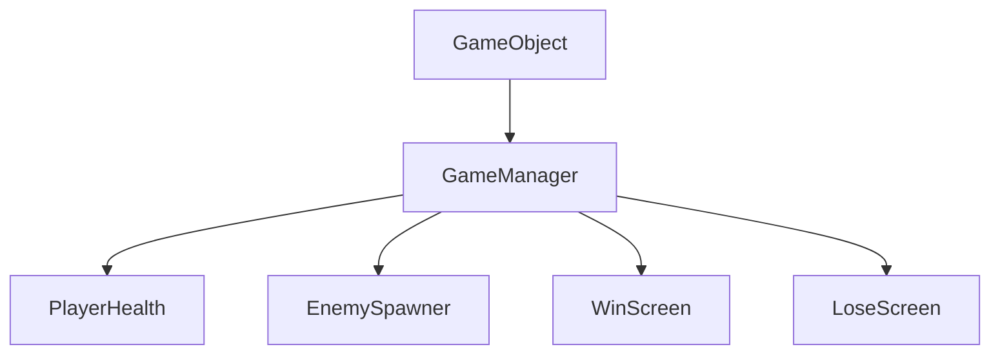
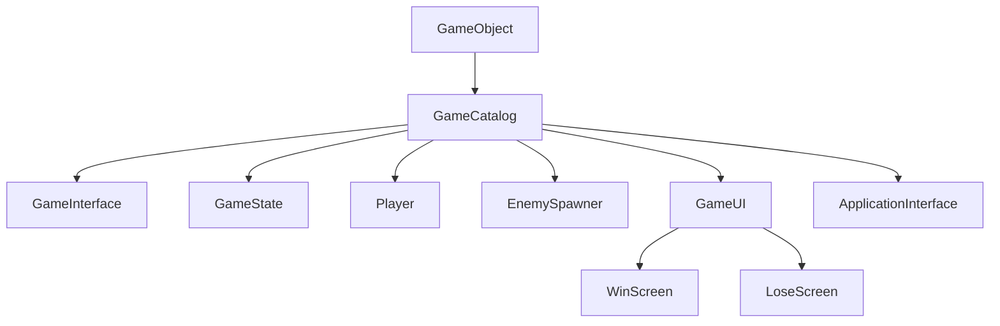

# Classic Plus

### Summary

Classic Plus builds upon the Classic architecture.

It focuses on following better code conventions compared to classic, 
and also introduces the Singleton and Service Locator Pattern.

### Singleton Pattern

```csharp
public class GameCatalog : MonoBehaviour
{
    private static GameCatalog _instance;
    public static GameCatalog Instance
    {
        get
        {
            if (_instance == null)
            {
                _instance = FindObjectOfType<GameCatalog>();
            }
            return _instance;
        }
    }
    [field: SerializeField] public GameInterface GameInterface { get; private set; }
    [field: SerializeField] public GameState GameState { get; private set; }
    [field: SerializeField] public GameObject Player { get; private set; }
    [field: SerializeField] public EnemySpawner EnemySpawner { get; private set; }
    [field: SerializeField] public GameUI UI { get; private set; }
    [field: SerializeField] public ApplicationInterface App { get; private set; }

    }
}
```
We store a static instance of the class as a member variable so that it's accessible via a global scope.

What makes this a Service Locator pattern is the fact we only store references to other Components, and contains no logic.

This is the recommended way to use the Singleton Pattern in Unity.


### Conventions

```csharp
// Before.
public int Speed = 5;
```

This is a fast way to write, but leaves the field publicly writeable from outside the class, not encapsulated.

```csharp
// After.
[field : SerializedField]
public int Speed { get; private set; } = 5;
```
This syntax allows us to encapsulate the property as well as have it still settable in the editor.

### Prefab References

```csharp
// Before.
public GameObject Enemy;
```

```csharp
// After
[field : SerializedField]
public Enemy Enemy { get; private set; };
```
Instantiating the component we need allows us to avoid a GetComponent<>() call.

### Component Architecture

We also expanded the component architecture by taking manager and controller classes, and splitting them up into small components.

Before:

After:


### Breaking the Rules!

There are some places where it might be a better idea to avoid the Entity-Component Architecture. Namely UI.
The User Interface is like a layer that sits nicely on top of our game. UI can be quite complex and may require state management as complicated, if not more complicated than the game itself.

For this reason it's generally a good idea to NOT have game components and UI components talk directly to each other, as this can make the UI state very difficult to track.

Instead, we can use a component at the root our UI canvas to act as an interface between the UI and the game, acting as a clean cut off point between the two systems. This wont always be appropriate, but in smaller projects is preferable to having the UI and Game strongly coupled.

